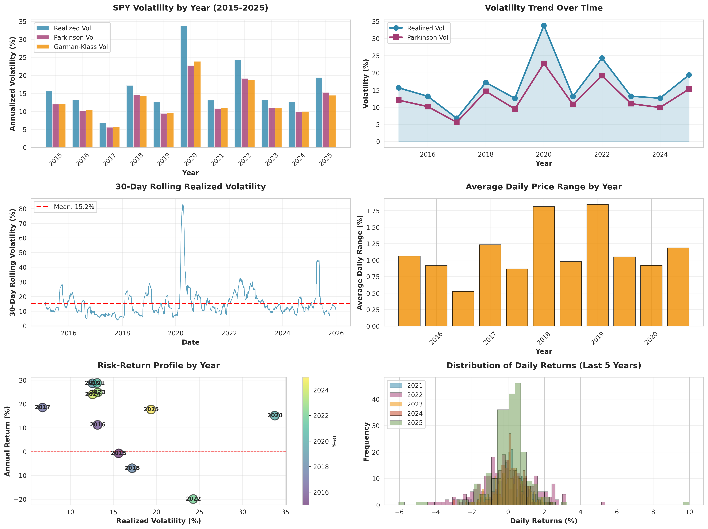

# 📊 SPY Volatility Analysis (2015-2025)

A comprehensive analysis of SPY (S&P 500 ETF) historical volatility using multiple volatility estimators and visualizations.



## 🎯 Overview

This project analyzes 10 years of SPY daily OHLC data (2015-2025) to calculate and visualize various volatility metrics, providing insights into market risk and behavior over time.

## 📈 Key Features

- **Multiple Volatility Estimators**:
  - Realized Volatility (Close-to-Close)
  - Parkinson Volatility (High-Low Range)
  - Garman-Klass Volatility (OHLC-based)
  - Average True Range (ATR)

- **Comprehensive Visualizations**:
  - Year-by-year volatility comparison
  - Volatility trends over time
  - 30-day rolling volatility
  - Risk-return scatter plot
  - Daily return distributions
  - Average daily price ranges

## 🚀 Quick Start

### Prerequisites

```bash
pip install -r requirements.txt
```

### Running the Analysis

```bash
python spy_volatility_analysis.py
```

### Input Data Format

The script expects a CSV file with the following columns:
- `time`: Date (YYYY-MM-DD format)
- `open`: Opening price
- `high`: Daily high price
- `low`: Daily low price
- `close`: Closing price

## 📊 Key Findings (2015-2025)

| Metric | Value |
|--------|-------|
| Average Realized Volatility | 16.51% |
| Highest Volatility Year | 2020 (33.77%) |
| Lowest Volatility Year | 2017 (6.77%) |
| Average Annual Return | 12.81% |
| Best Performing Year | 2021 (28.79%) |

### Notable Observations:

- **2020 COVID-19 Impact**: Volatility spiked to 33.77%, the highest in the 10-year period
- **2017 Low Vol**: The calmest year with only 6.77% volatility
- **2022 Bear Market**: High volatility (24.29%) with negative returns (-19.95%)
- **2023-2024 Recovery**: Volatility normalized with strong positive returns

## 📁 Project Structure

```
spy-volatility-analysis/
│
├── spy_volatility_analysis.py    # Main analysis script
├── requirements.txt               # Python dependencies
├── README.md                      # This file
├── LICENSE                        # MIT License
│
└── outputs/
    ├── spy_volatility_analysis.png    # Visualization dashboard
    └── spy_volatility_summary.csv     # Summary statistics CSV
```

## 🔬 Volatility Metrics Explained

### 1. Realized Volatility (Close-to-Close)
Standard deviation of log returns, annualized by multiplying by √252. Most common volatility measure.

```python
σ = std(log(Close_t / Close_t-1)) × √252
```

### 2. Parkinson Volatility
Uses high-low range, more efficient than close-to-close as it captures intraday movement.

```python
σ = √(1/(4×ln(2)) × mean(ln(High/Low)²)) × √252
```

### 3. Garman-Klass Volatility
Incorporates OHLC data for even better efficiency, accounting for opening jumps and trading range.

```python
σ = √(0.5 × HL² - (2ln(2) - 1) × CO²) × √252
```

### 4. Average True Range (ATR)
Measures absolute price movement, useful for comparing volatility across different price levels.

## 📝 Customization

### Analyze Different Ticker
```python
df = load_data('your_ticker_data.csv')
```

### Change Date Range
```python
df = df[(df.index.year >= 2020) & (df.index.year <= 2025)]
```

### Adjust Rolling Window
```python
df['rolling_vol'] = df['returns'].rolling(window=60).std() * np.sqrt(252)
```

## 🛠️ Technologies Used

- **Python 3.8+**
- **Pandas**: Data manipulation
- **NumPy**: Numerical computations
- **Matplotlib**: Visualization
- **Seaborn**: Statistical plots

## 📊 Sample Output

The script generates two files:

1. **spy_volatility_analysis.png**: Multi-panel dashboard with 6 visualizations
2. **spy_volatility_summary.csv**: Detailed year-by-year statistics

## 🤝 Contributing

Contributions are welcome! Feel free to:
- Add new volatility estimators (Yang-Zhang, Rogers-Satchell, etc.)
- Implement additional visualizations
- Add statistical tests for volatility clustering
- Compare with VIX (implied volatility)

## 📄 License

This project is licensed under the MIT License - see the [LICENSE](LICENSE) file for details.

## 🙏 Acknowledgments

- Data source: BATS SPY daily OHLC
- Volatility formulas based on academic literature from Parkinson (1980) and Garman-Klass (1980)

## 📧 Contact

Questions or suggestions? Open an issue or submit a pull request!

---

⭐ If you find this project useful, please consider giving it a star!
